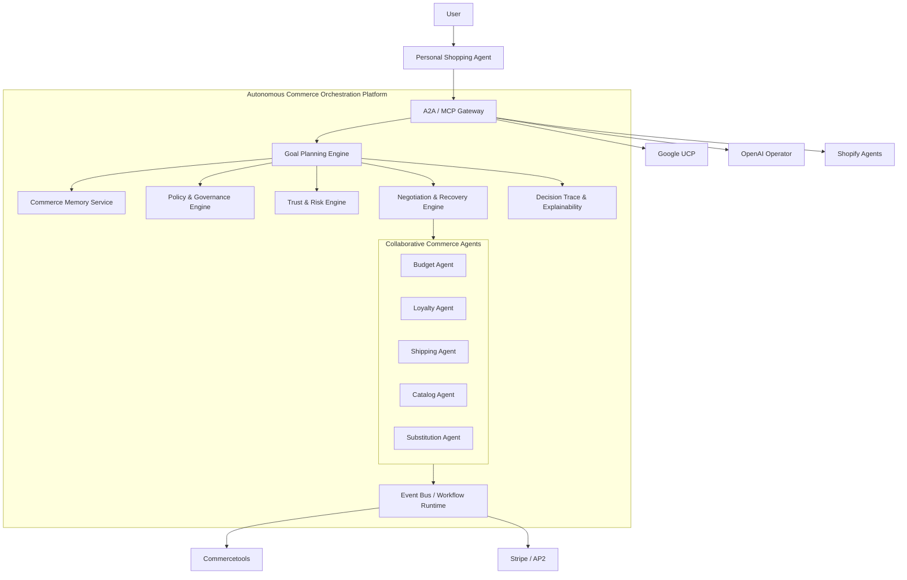

# Phase 2 Roadmap & Strategic Evolution Plan

## Autonomous Agentic Commerce Platform

This roadmap evolves the current Commercetools + MCP demo into a true autonomous commerce platform capable of supporting intelligent multi-agent shopping, governed autonomous checkout, adaptive negotiation, and protocol-agnostic ecosystem interoperability.

The objective is no longer simply exposing commerce APIs to AI systems.

The objective is to demonstrate:

* autonomous commerce workflows
* persistent shopper intelligence
* governed AI purchasing
* collaborative multi-agent decision-making
* adaptive recovery and negotiation
* trust-aware autonomous checkout

This positions the platform as an extensible autonomous commerce orchestration layer rather than a protocol-specific integration project. 

---

# 1. Strategic Vision

Traditional ecommerce systems are transactional:

* user searches
* user clicks
* user compares
* user checks out

Agentic commerce systems are goal-driven:

* AI agents plan purchases
* optimize constraints
* negotiate terms
* adapt to failures
* execute governed autonomous transactions

The platform will evolve into an:

# Autonomous Commerce Orchestration Platform (ACOP)

Core principles:

* protocol agnostic
* memory driven
* event driven
* policy governed
* explainable
* trust aware

---

# 2. Target Future-State Architecture



---

# 3. Strategic Platform Capabilities

## 3.1 Persistent Commerce Memory

The platform must maintain long-lived shopper intelligence across sessions.

### Capabilities

* brand affinity tracking
* reorder pattern detection
* budget preference learning
* sustainability preferences
* dietary/restriction awareness
* shipping preference learning

### Example Behaviors

#### Example 1

User:

> “Avoid fast-fashion brands.”

Future autonomous recommendations automatically adapt.

#### Example 2

User:

> “Use premium products for home purchases but optimize aggressively for office supply orders.”

Agent behavior dynamically changes based on purchase context.

### Deliverables

* Shopper Memory Service
* Semantic Preference Store
* Vector Search Integration
* Contextual Recommendation Engine

---

# 4. Phase 2 Roadmap

---

# Phase 2A — Agent Intelligence Foundation

## Weeks 1–4

Objective:
Transform the current MCP implementation from an API wrapper into an intelligent commerce orchestration layer.

---

## Key Initiatives

### 1. Shopper Memory Service

Build persistent memory capabilities for user shopping behavior and preferences.

### Features

* semantic preference storage
* session continuity
* contextual shopping profiles
* memory retrieval APIs

### APIs

```http
POST /api/memory/preferences
GET /api/memory/context/{userId}
```

---

### 2. Goal Planning Engine

Shift from transactional flows to objective-driven workflows.

### Example Goals

* “Restock kitchen under €120”
* “Prepare for a hiking trip”
* “Optimize monthly office snack budget”

### Capabilities

* task decomposition
* constraint optimization
* multi-step planning
* dynamic prioritization

---

### 3. Explainability Layer

Provide reasoning visibility for all autonomous decisions.

### Features

* confidence scoring
* decision traces
* recommendation rationale
* policy evaluation audit trails

---

## Deliverables

* Commerce Memory Engine
* Goal Planning Service
* Explainability APIs
* Enhanced MCP semantic orchestration

---

# Phase 2B — Multi-Agent Commerce Orchestration

## Weeks 5–8

Objective:
Enable collaborative autonomous commerce workflows between specialized agents.

---

## Key Initiatives

### 1. Collaborative Agent Runtime

Deploy specialized commerce agents.

### Agent Types

| Agent              | Responsibility             |
| ------------------ | -------------------------- |
| Budget Agent       | Spend optimization         |
| Loyalty Agent      | Reward optimization        |
| Shipping Agent     | Delivery optimization      |
| Catalog Agent      | Product discovery          |
| Substitution Agent | Alternative recommendation |
| Trust Agent        | Risk evaluation            |

---

### 2. Autonomous Negotiation Engine

Move beyond static discount APIs into dynamic commerce negotiation.

### Capabilities

* bundle optimization
* loyalty redemption negotiation
* shipping tradeoff evaluation
* substitution recommendations
* urgency-aware pricing

---

### Example Scenarios

#### Example 1

Original item unavailable:

* substitute agent finds alternatives
* shipping agent adjusts delivery
* budget agent recalculates total
* user approval requested only if confidence drops

#### Example 2

Budget exceeded:

* negotiation engine proposes:

  * delayed shipping
  * alternative brands
  * loyalty redemption

---

### 3. Event-Driven Workflow Runtime

Introduce durable autonomous execution.

### Recommended Technologies

* Kafka or NATS
* Temporal
* LangGraph durable execution
* Event sourcing patterns

### Benefits

* asynchronous recovery
* workflow resiliency
* retry orchestration
* stateful long-running agent tasks

---

## Deliverables

* Agent Runtime Framework
* Negotiation Engine
* Event Bus Integration
* Autonomous Recovery Workflows

---

# Phase 2C — Trust, Governance & Autonomous Payments

## Weeks 9–12

Objective:
Enable secure, policy-governed autonomous purchasing.

---

## Key Initiatives

### 1. AP2 Mandate Verification

Extend existing AP2 implementation into enterprise-grade autonomous payment governance.

### Features

* FIDO verification
* cryptographic mandate validation
* nonce validation
* replay attack prevention
* short-lived signed intents

---

### 2. Trust & Risk Engine

Introduce adaptive autonomous commerce trust controls.

### Capabilities

* spending velocity controls
* anomaly detection
* merchant trust scoring
* AI confidence evaluation
* escalation policies

---

### Example Policies

#### Example 1

```yaml
IF amount < 50 EUR
THEN autonomous_checkout = allowed
```

#### Example 2

```yaml
IF amount > 300 EUR
THEN biometric_confirmation = required
```

---

### 3. Policy-as-Code Governance

Introduce configurable AI commerce governance.

### Recommended Technologies

* Open Policy Agent (OPA)
* Cedar

### Policy Examples

* prohibit restricted product categories
* limit overnight shipping usage
* enforce enterprise procurement rules

---

## Deliverables

* Trust Engine
* Policy Engine
* AP2 Verification Service
* Autonomous Checkout Governance APIs

---

# Phase 2D — Protocol & Ecosystem Interoperability

## Weeks 13–16

Objective:
Position the platform as a protocol-agnostic autonomous commerce infrastructure layer.

---

## Key Initiatives

### 1. Universal Agent Gateway

Support multiple external commerce ecosystems.

### Supported Integrations

* Google Universal Commerce Protocol
* OpenAI Operator ecosystem
* Shopify agent integrations
* future A2A ecosystems

---

### 2. Protocol Adapter Framework

Prevent vendor lock-in by abstracting external commerce protocols.

### Architecture Principle

External protocols become interchangeable adapters rather than platform dependencies.

---

### 3. Multi-Surface Autonomous Checkout

Support:

* conversational checkout
* proactive replenishment
* embedded AI assistant purchasing
* cross-platform persistent carts

---

## Deliverables

* Protocol Adapter SDK
* Universal Agent Gateway
* Multi-Surface Checkout Support
* Ecosystem Integration Test Suite

---

# 5. Security & Compliance Strategy

---

## 5.1 Autonomous Commerce Security

### Critical Controls

* signed mandates
* replay protection
* nonce validation
* approval escalation
* behavioral anomaly detection

---

## 5.2 Auditability

Every autonomous decision must be explainable and auditable.

### Requirements

* immutable decision logs
* reasoning trace storage
* signed transaction lineage
* mandate archival

---

## 5.3 Abuse Prevention

### Required Controls

* A2A rate limiting
* bot abuse protection
* merchant trust scoring
* suspicious behavior detection

---

# 6. Example Autonomous Commerce Journeys

---

## Journey 1 — Autonomous Restocking

User Goal:

> “Restock my kitchen for the next two weeks under €150.”

### Agent Workflow

1. Planner decomposes objective
2. Memory engine retrieves preferences
3. Budget agent allocates spending
4. Catalog agent finds products
5. Loyalty agent applies rewards
6. Shipping agent optimizes delivery grouping
7. Trust engine evaluates risk
8. AP2 executes autonomous checkout

---

## Journey 2 — Adaptive Failure Recovery

Scenario:
Selected item becomes unavailable during checkout.

### Recovery Workflow

1. Substitution agent identifies alternatives
2. Budget agent recalculates impact
3. Shipping agent preserves delivery window
4. Policy engine validates substitution rules
5. Autonomous execution continues without restarting workflow

---

# 7. Strategic Positioning

This platform should not be positioned as:

* “Google commerce integration”
* “AI-powered ecommerce APIs”

Instead position it as:

# Autonomous Commerce Infrastructure Platform

Core value:

* governed autonomous purchasing
* intelligent commerce orchestration
* protocol-agnostic interoperability
* enterprise-grade AI commerce governance

---

# 8. Success Metrics

| Metric                           | Target     |
| -------------------------------- | ---------- |
| Autonomous Checkout Success Rate | >90%       |
| Average Recovery Resolution Time | <5 seconds |
| Policy Violation Rate            | <0.1%      |
| Autonomous Substitution Accuracy | >85%       |
| Explainability Trace Coverage    | 100%       |
| Fraud/Replayed Mandate Detection | 100%       |

---

# 9. Final Outcome

By the completion of Phase 2, the platform will demonstrate:

* autonomous commerce planning
* persistent shopper intelligence
* collaborative multi-agent negotiation
* governed autonomous checkout
* adaptive workflow recovery
* explainable AI purchasing decisions
* protocol-agnostic commerce interoperability

The result is not merely AI-enhanced ecommerce.

It is a foundational autonomous commerce operating model for the next generation of AI-driven purchasing ecosystems.
