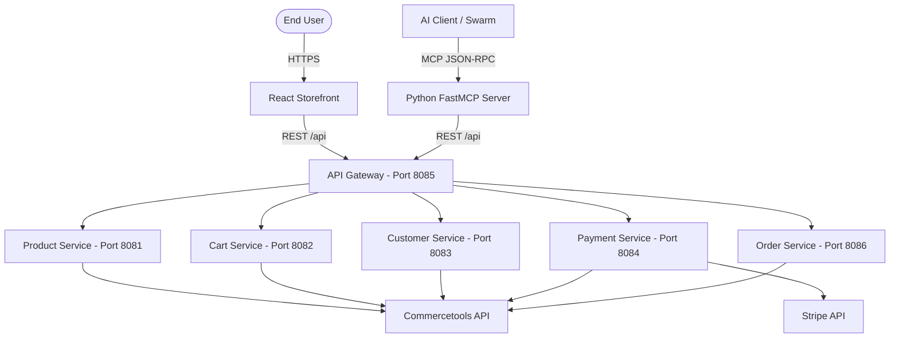

# Project Architecture Review: Composable Agentic Commerce (Phase 1)

This project, **Composable Agentic Commerce**, represents the foundation layer (Phase 1) of a modern, headless e-commerce application integrated with autonomous AI agents via the Model Context Protocol (MCP). It features a microservice backend, a React storefront, and a FastMCP Python bridge.

Below is a detailed structural and architectural analysis of the project.

---

## 🏛️ Overall System Architecture

The foundation layer is divided into three key boundaries, all coordinated using a local development setup with Docker Compose.

---

## 💻 Backend Microservices (`phase-1/backend`)

The core business logic is engineered as a set of decoupled Spring Boot microservices behind a Spring Cloud Gateway.

### Tech Stack
* **Language/Framework**: Java 17, Spring Boot, Spring WebFlux.
* **Server**: High-concurrency Netty.
* **E-Commerce SDK**: `commercetools-sdk-java-api` (v18.2.0) with non-blocking requests.
* **Packaging**: Maven (multi-module project layout).

### Key Architectural Highlights
1. **Reactive Pipeline Implementation**: 
   Every microservice relies on Spring WebFlux. By transforming Commercetools' native Java `CompletableFuture` objects into Project Reactor `Mono` streams, the backend remains entirely non-blocking. This dramatically reduces idle thread resource consumption, enabling the microservices to handle high levels of concurrent I/O requests.
2. **API Gateway Pattern**: 
   The `api-gateway` module consolidates routes and exposes a single entry point (`http://localhost:8085`) for both the frontend React storefront and the MCP server, hiding internal topology.
3. **Data Integrity & Boundary Validation**: 
   Using `jakarta.validation` on custom Request DTOs (e.g., `AddressRequestDTO`), the backend validates input at the controllers before issuing SDK calls. This safeguards the internal pipelines from malformed payloads.
4. **Stripe Payment Orchestration**:
   The `payment-service` calculates cart values and generates hosted Stripe Checkout session URLs. This keeps card input flows completely separate from the customer session (and the LLM environment), providing a secure, PCI-compliant checkout structure.

---

## 🎨 Frontend Storefront (`phase-1/frontend`)

A consumer storefront built as a modern Single Page Application (SPA).

### Tech Stack
* **Language/Framework**: React 18 (using Vite as the build tool).
* **Styling**: Vanilla CSS.
* **Animations**: Framer Motion.
* **State Management**: React Context API (`CartContext`).

### Key Architectural Highlights
1. **Cart Context & State Rehydration**:
   The global state is managed by `CartContext.jsx`. The application stores the Commercetools `cartId` in `localStorage` to rehydrate state on app reload. 
2. **State Synchronization**:
   To prevent inconsistencies, state-mutating actions (like changing shipping methods) trigger an explicit `refreshCart()` request. The UI totals (due, taxes, delivery) are updated in real-time based on backend projections.
3. **Artisan Aesthetics**:
   The design features smooth layout transitions, shimmering skeleton cards instead of rigid spinners, and a reactive, spring-animated slide-out cart drawer.
4. **Production Build Pattern**:
   The application uses a multi-stage Docker build:
   - **Stage 1 (Node.js)**: Runs npm build to generate optimized static files in `/dist`.
   - **Stage 2 (Nginx)**: Serves those static files using a lightweight Alpine image, ensuring minimal container sizes.

---

## 🔌 Foundational MCP Server (`phase-1/foundational-mcp-server`)

A bridge that enables LLMs (such as Gemini or Claude) to interact with the commerce system directly via tools.

### Tech Stack
* **Language/Framework**: Python 3.10+, FastMCP framework.
* **HTTP Client**: `httpx` (async).

### Exposed Tools
* **Catalog Discovery**: `get_collection`, `search_products`, `get_piece_detail`
* **Cart Lifecycle**: `initialize_cart`, `add_to_cart`, `get_cart`, `set_cart_customer`
* **Shipping/Addresses**: `set_shipping_address`, `get_shipping_methods`, `set_shipping_method`
* **Payment & Checkout**: `create_payment`, `add_payment_to_cart`, `create_stripe_checkout`, `place_order`
* **Profiles**: `get_customer_profile`, `update_customer_profile`, `get_customer_by_email`

### Key Architectural Highlights
1. **Safe Agent Actions**:
   To place an order, the server enforces a pre-order safety check: the cart must have a payment associated with it. The agent is forced to call `create_stripe_checkout` and direct the customer to the resulting Stripe URL before it can execute `place_order`.
2. **Idempotency & Resilience**:
   During payment registration or ordering failures, the MCP server performs active lookups (`_check_for_existing_order`) before erroring out. If an order has already been finalized, it returns the existing order details, avoiding duplicate requests.

---

## 🛠️ Build & Automation (`.github/workflows/build.yml`)

The codebase uses GitHub Actions for continuous integration.
* **Backend Job**: Sets up JDK 17, caches Maven libraries, and runs `mvn clean verify -DskipTests` to validate compile-time health.
* **Frontend Job**: Sets up Node.js 20, caches npm resources, and verifies building correctness via `npm ci` and `npm run build`.

---

## 💡 Recommendations & Areas of Improvement

While the Phase 1 Foundation Layer is highly structured, secure, and modern, here are some design suggestions for the next stages of development:

1. **Gateway Authentication**:
   Currently, the API Gateway routes requests directly to the microservices. For production, introducing a lightweight JWT validation middleware or session check at the gateway layer will prevent unauthorized direct requests.
2. **Service Discovery / Internal Communication**:
   If the microservice swarm expands, replacing hardcoded service hostnames in Docker with a service discovery tool (like Consul or Spring Cloud Eureka) would improve dynamic scaling.
3. **Structured Logging Aggregation**:
   The services stream logs to stdout/stderr. Incorporating a shared JSON logging format or routing them to a central collector (e.g., Loki or Elasticsearch) would make multi-microservice debugging simpler.
4. **Transition to Phase 2 (Swarm Orchestration)**:
   As the project moves into Phase 2, these deterministic tools will be consumed by specialized swarms (Product Specialist, Returns, Checkout). Documenting API error codes within MCP tool descriptions will help the agents recover from exceptions autonomously.
